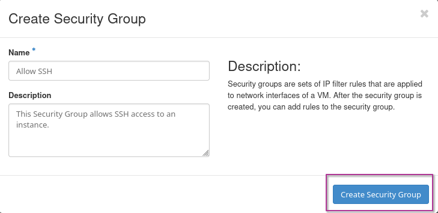
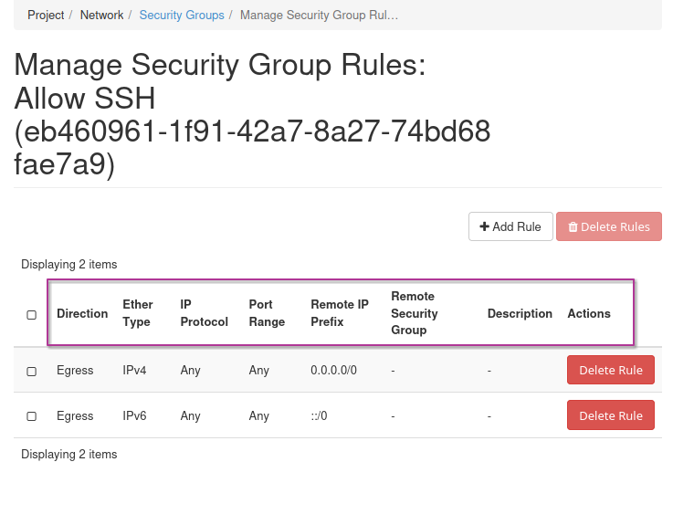
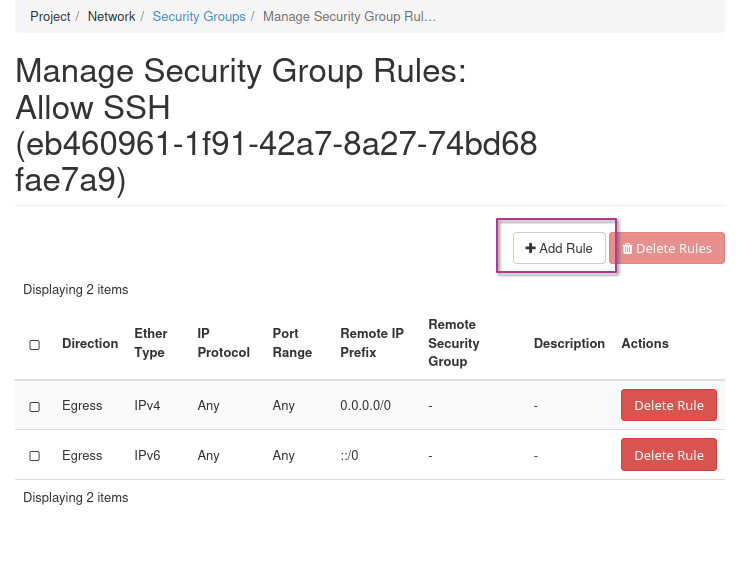
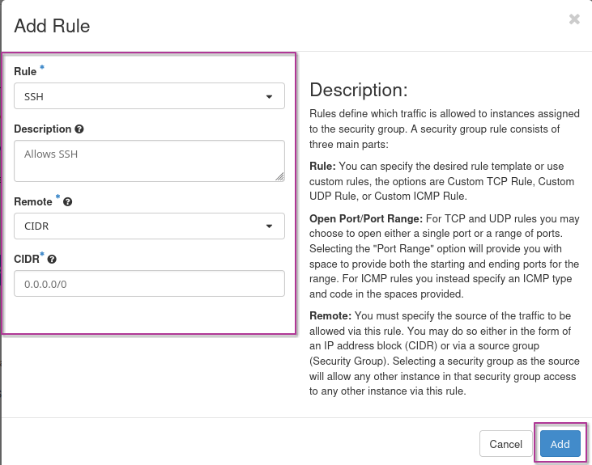

# Securtiy Groups Guide
```
This guide provides a step by step walkthrough of how to get started utilizing security groups in OpenStacks
```

# What are Security Groups
```
Security Groups are what allows you to determine what inbound and outbound traffic is allowed into your instances (virtual machines).
In simple terms they act like a virtual firewall that operates at the instance level, controlling access based on IP addressess, port numbers, and protocols.
```

# OpenStacks Default Security Group Settings
```
When creating an instance on OpenStack if you don't implement your own security group it will use its default.
The default rules set the following standard:
    
    Inbound Traffic: Blocked by default
    Outbound Traffic: Allowed by default

Depending on your security and accessibility needs you'll need to tailor your secuity groups accordingly.
```

# Example- Allowing SSH via Security Groups
 
## 1. Once you have logined into your openstack portal navigate to the Networks tab and click Security Groups located in the column on the left hand side of the screen


## 2. Click on Create Security Group


## 3. Name your new Secuirty Group something like "Allow SSH" or something similar to make it easier to remember in the future. You can also add a description for further clarification. When you're finished naming click Create Security Group.
 


## 4. You'll then be taken to the rule management papge. Here you can add the specific rules you want for traffic on your instance. Here's a break down of the terms you'll see:
 


```
    Egress: Outgoing network traffic from your vm

    Ingress: Inbound network traffic to your vm

    Ether Type: Identifies the protocal type of the payload (Typically IPv4 or IPv6)

    IP Protocol: Specifies which network protocol the rule applies to (TCP, UDP, ICMP)

    Port Range: Specifies which ports the rule applies to
        Port 22: Typically used for SSH traffic
        Port 80: Typically used for HTTP web traffic

    Remote IP Prefix: Defines the source or destination IP addresses in CIDR notation

    Remote Security Group: Specifies another security group as the source or destination

```
## 5. Click on Add Rule



## 6. Update the following drop down boxes to all SSH and click add to create the new rule



## 7. (Optional) If you'd like to be able to ping your instance to check if it's working for inbound ssh traffic you can add another rule to allow ICMP (Internet Control Message Protocol)


# Summary
## Now you should be all set to create and add your own Security Groups to your instances. Good luck on your Infra journey!

[//]: # ()